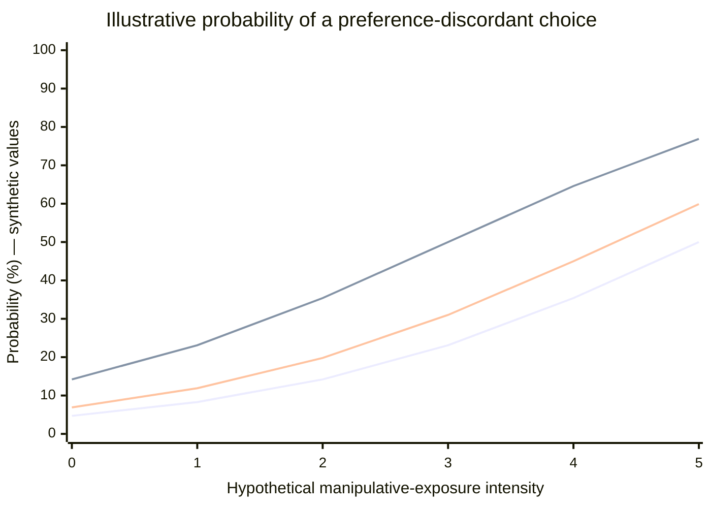

# Epistemic Integrity Stress Test

# 1 Purpose of the Test

The purpose of this stress test is to evaluate the epistemic robustness of a text generated by a closed autoregressive(GPT-6 Astra) model. 
The text produced is subjected to external validation (MarCognity-AI) in order to make the 'fracture' between linguistic coherence and epistemic foundation observable, identifying the residual regime of uncertainty (Epistemic Boundary) that remains despite the apparent authoritativeness of the tone.
The goal is not to compare models, but:
Domain-specific content is not evaluated.
The analysis concerns exclusively the epistemic structure of the text.

The procedure is fully reproducible and can be replicated with any closed autoregressive model and any independent external validator.

# 2 prompt used (taken from marcognity)
You are an intelligent and multidisciplinary academic tutor. Respond to the problem **{problem}**, and reply in **{target_language}**.
Explain the concept: **"{topic}"** with academic rigor and multidisciplinary analysis.
Do not merely describe sources: build an autonomous, critical, and original discussion.

The user has selected: **{chart_choice}**

Context: Required level: **{level}** Concept: **{concept}** Topic: **{topic}** Subject: **{subject}**
The response must be long and in-depth.

Analyze the following question or text: **{problem}**

**Relevant scientific articles**:
- arXiv: **{arxiv_search}**
- PubMed: **{pubmed_search}**
- OpenAlex: **{openalex_search}**

**Phase 1: Problem Analysis** – Explain the main concepts related to the topic.
**Phase 2: Theoretical and/or Mathematical Development** – Use formulas, models, or theories to explain and solve.
- Provide a critical comparison between existing theories, including advantages, limitations, and scientific ambiguities.
**Phase 3: Visualization** – Integrate a visual representation consistent with the analyzed concept, transforming the graphic into a didactic interpretation tool.
- If the text contains numerical data or measurable variables, **generate a real chart** using the function `generate_universal_chart(text)`.
- If data are not explicitly present, **synthesize plausible values** or use a **visual fallback** consistent with the problem type.
- **Describe the chart in the context of the explanation**:
  - Explain the meaning of the axes.
  - Interpret the type of trend shown (e.g., exponential growth, Gaussian distribution).
  - Illustrate how the chart contributes to understanding the phenomenon.
- Avoid technical placeholders like `generate_universal_chart(text)` or “[Insert chart]”.
- Include **an automatic caption** describing the scientific intent of the visualization.
- If the topic is theoretical, abstract, or relational, generate **conceptual diagrams** showing interconnections, hierarchies, logical flows, or dynamics.
- In physical, chemical, or dynamic domains, suggest **virtual simulations**, reproducible experiments, or interpretable animated models.
- The visualization must actively contribute to the discussion, offering the reader cognitive and interpretive support that reinforces the textual explanation.

**Phase 4: Tone Optimization** – Adapt the content to the selected level with clarity.
**Phase 5: Summary** – Summarize key points, practical applications, and useful references.
**Phase 6: Future Implications** – Describe potential applications, methodological limitations, and emerging research directions.

Respond by providing an explanation suited to the indicated level:
- **Basic**: Simplified explanation with intuitive examples.
- **Advanced**: In-depth discussion with technical and mathematical details.
- **Expert**: Academic analysis with rigorous scientific formulations.
- If you detect errors in the question, correct them before responding.
- Use **rigorous academic terminology**, avoiding generic responses.
- If the question is ambiguous, clarify it before responding.
- Always provide scientific references to validate claims.
- Provide an example of the topic **{topic}**.
- Include at least **5 scientific references**, preferably peer-reviewed, and **direct citations from articles** when possible.
*Ethical note*: This content involves sensitive concepts and should be interpreted in a scientific, educational, and non-normative context.

Analyze the following paper and provide a detailed scientific review:
**{paper_text}**

Evaluate the quality of the methodology and verify citation consistency.
If the concept is particularly complex, expand the discussion into multiple subsections and suggest future research questions.
Suggest improvements for the paper and indicate more recent sources.
Provide an **extended** response, divided into well-defined sections, with at least 1500 words. Use technical language, quantitative examples, and specific bibliographic references.
and translated directly into **{target_language}**.

### 3 Generated text (GPT-6 Astra)

User Psychological Deception: Cognitive Mechanisms, Manipulative Design, and Vulnerability 

## Preliminary clarification

No paper text was included after “Paper text to analyze.” A paper-specific assessment of methods, results, and validity is therefore not possible. The discussion below provides an independent, research-grounded analysis using peer-reviewed literature in psychology, human–computer interaction, behavioral economics, and privacy research.

“User psychological deception” is not a single, universally standardized psychological construct. It is best treated as an interdisciplinary category encompassing practices that distort users’ understanding or exploit vulnerabilities in their decision-making. Its boundaries require care: **not every influence is manipulation, not every manipulation involves a false statement, and not every unwanted outcome demonstrates deception.**

---

## Phase 1 — Problem Analysis: Concepts and Mechanisms

## 1. Defining user psychological deception

A useful working definition is:

> **User psychological deception is the use of communicative, social, or interface-mediated practices that predictably produce materially misleading beliefs, or materially misleading interpretations of a choice situation, to influence a user’s behavior.**

“Materially” means that the distortion concerns something reasonably relevant to the decision: price, risk, consent, identity, reversibility, social endorsement, or the consequences of an action.

This definition separates deception from the broader category of **psychological manipulation**:

> **Psychological manipulation influences decision-making by exploiting, bypassing, or undermining a person’s capacities for informed and sufficiently independent judgment.**

The two overlap but are not identical:

- A fabricated testimonial is deceptive because it misrepresents evidence.
- A deliberately exhausting cancellation process may be manipulative without making any false factual claim.
- An emotionally compelling advertisement may be persuasive without necessarily being deceptive or manipulative.
- A warning that accurately explains serious consequences may create fear without improperly exploiting it.

Consequently, the relevant question is not simply whether an interface affects behavior. All interfaces do. The question is **how that influence operates and whether it undermines meaningful agency**.

## 2. Persuasion, deception, manipulation, and coercion

| Concept | Principal mechanism | Relationship to user agency |
|---|---|---|
| **Persuasion** | Reasons, evidence, or openly identifiable appeals | Can support deliberation when claims are assessable |
| **Deception** | Falsehoods, misleading implications, omissions, or deceptive presentation | Corrupts the informational basis of choice |
| **Manipulation** | Exploitation of attention, emotion, dependency, or decision-process vulnerabilities | Can undermine meaningful control even without false beliefs |
| **Coercion** | Threats or severe constraints on available options | Makes refusal costly or practically unavailable |
| **Choice architecture** | Organization of options, defaults, and decision sequences | Can assist or undermine agency, depending on design and governance |

These categories can coexist. For example, a subscription interface might conceal recurring charges, preselect renewal, and make cancellation difficult. The first mechanism is primarily informational; the second changes the default; the third imposes procedural costs.

### Why this distinction matters

Treating all influence as manipulation makes the concept analytically weak. Treating only explicit lies as deceptive makes it too narrow.

A rigorous assessment should examine:

1. **Informational accuracy:** What does the user reasonably understand?
2. **Decision-process integrity:** Can the user attend to and evaluate relevant information?
3. **Freedom to refuse:** Is rejection genuinely accessible?
4. **Reversibility:** Can the user correct a mistake without disproportionate cost?
5. **Preference alignment:** Does the resulting action reflect an adequately informed choice?
6. **Distribution of consequences:** Who benefits, and who bears the risks?

---

## 3. Cognitive vulnerability is relational, not merely personal

A common mistake is to imagine deception as something that succeeds only against unusually gullible individuals.

In reality, susceptibility often emerges from an interaction:

\[
V = f(P, C, D, R)
\]

where:

- \(P\): person-related factors, such as expertise, fatigue, or current emotional state;
- \(C\): contextual factors, such as urgency, distraction, or social pressure;
- \(D\): design characteristics, including complexity, defaults, and visibility;
- \(R\): relational and institutional factors, including dependency and power asymmetry.

This expression is a conceptual model, not an established measurement equation.

The key implication is that **vulnerability is often produced by the environment**. A highly educated user can make poorly informed decisions when essential terms are scattered across screens, refusal requires repeated actions, and the decision occurs under time pressure.

### Three interacting forms of vulnerability

**Cognitive vulnerability**  
Limits in attention, working memory, numeracy, or understanding of unfamiliar systems.

**Affective vulnerability**  
Anxiety, loneliness, urgency, hope, embarrassment, or fear of exclusion that changes the weighting of evidence and consequences.

**Structural vulnerability**  
Dependence on a platform, lack of alternatives, inaccessible interfaces, language barriers, or inability to absorb financial loss.

These are not interchangeable. Explaining everything through “cognitive bias” can obscure institutional responsibility.

---

## 4. Related manipulation techniques: A mechanism-based classification

The following classification is intended for analysis, detection, and prevention.

### A. Epistemic manipulation: Distorting what users believe

Examples include:

- Concealing total prices or recurring commitments.
- Presenting advertising as independent information.
- Fabricating reviews, endorsements, or popularity indicators.
- Suggesting that an optional action is mandatory.
- Creating a misleading impression of scarcity.

The central mechanism is **evidence distortion**: users update beliefs using signals whose reliability or meaning has been misrepresented.

An important distinction is between *false scarcity* and *real scarcity*. A truthful notice about limited availability is not inherently deceptive. The problem arises when the claimed limitation is fabricated, materially incomplete, or presented misleadingly.

### B. Attentional manipulation: Distorting what becomes salient

Examples include:

- Making acceptance visually prominent while making refusal difficult to notice.
- Separating a favorable headline from a crucial qualification.
- Presenting irrelevant information at the moment a user needs to evaluate risk.
- Overloading a screen so that meaningful differences become difficult to process.

Attention is a scarce resource. Information can be technically present yet functionally inaccessible.

This explains why disclosure alone is an inadequate safeguard: **availability is not equivalent to comprehension or usable notice**.

### C. Procedural manipulation: Distorting the effort required to choose

Examples include:

- Easy enrollment paired with difficult cancellation.
- Repeated requests after an initial refusal.
- Unnecessary confirmation steps for rejecting an offer.
- Defaults that are hard to discover or reverse.

The mechanism is not always mistaken belief. Users may understand the situation and still comply because resistance is costly.

This is closely related to **sludge**: excessive or unjustified friction in a process.

### D. Affective and social manipulation

Examples include:

- Shaming language attached to refusal.
- Unsupported appeals to authority.
- Artificial social proof.
- Emotional pressure exploiting attachment, fear, or belonging.

These practices alter perceived social costs and emotional consequences.

However, emotional influence is not inherently illegitimate. Public-health communication, for example, can ethically communicate emotionally significant risks when the underlying evidence is accurate and the presentation proportionate.

### E. Temporal manipulation

Examples include:

- Pressuring users to decide before reviewing relevant terms.
- Foregrounding immediate benefits while obscuring delayed costs.
- Repeatedly interrupting a task until a user accepts an unrelated request.

Such practices exploit the asymmetry between immediate experience and future consequences.

### F. Relational manipulation in conversational systems

Conversational interfaces introduce additional issues:

- Unwarranted impressions of expertise.
- Ambiguity about whether the interlocutor is human or artificial.
- Simulated intimacy that users interpret as reciprocal care.
- Recommendations whose commercial incentives are concealed.
- Confident language that exceeds the reliability of the underlying information.

Here, deception can concern not only a product but the **nature of the relationship itself**.

Anthropomorphic presentation does not automatically prove deception. Its significance depends on what users are led to believe, what is disclosed, and whether those beliefs are exploited.

---

## Phase 2 — Theoretical and Mathematical Development

## 1. A general model: Manipulation creates a wedge between experienced and informed value

Consider a user choosing action \(a\) from a set \(A\).

Under a normative benchmark, the user evaluates:

\[
U^{I}(a)
=
\mathbb{E}[B(a)-C(a)\mid I]
\]

where:

- \(B(a)\): benefits;
- \(C(a)\): costs;
- \(I\): relevant, adequately understood information.

In a manipulated environment, the experienced evaluation may instead be:

\[
\widetilde{U}(a)
=
\mathbb{E}_{\widetilde{P}}
[\widetilde{B}(a)-\widetilde{C}(a)]
+
E(a)
-
F(a)
\]

where:

- \(\widetilde{P}\): beliefs shaped by distorted or selectively presented information;
- \(\widetilde{B}\) and \(\widetilde{C}\): perceived benefits and costs;
- \(E(a)\): emotional or social pressure associated with the action;
- \(F(a)\): effort imposed by the interface.

The user selects:

\[
a^{*}=\arg\max_{a\in A}\widetilde{U}(a)
\]

This choice can be locally understandable while differing from the choice made under accurate information and balanced decision conditions.

### Important limitation

An “informed preference” is not always a stable, pre-existing object. Preferences can develop through legitimate learning, reflection, and experience.

Accordingly, researchers should not define manipulation simply as “anything that changes a preference.” The stronger criterion concerns **the quality and legitimacy of the process producing the change**.

---

## 2. Bayesian analysis: Deception corrupts inference

Suppose a user evaluates a proposition \(H\):

> “This offer is trustworthy and advantageous.”

After observing a signal \(s\), Bayesian updating gives:

\[
\frac{P(H\mid s)}{P(\neg H\mid s)}
=
\frac{P(H)}{P(\neg H)}
\cdot
\frac{P(s\mid H)}{P(s\mid \neg H)}
\]

The final term is the likelihood ratio: how strongly the signal supports the proposition.

A misleading authority badge or fabricated review can lead users to assign the signal an exaggerated likelihood ratio.

The user’s reasoning may therefore be coherent **given the assumed reliability of the evidence**. The failure is not necessarily a defective inference process; it can be an adversarially contaminated information environment.

### Strength

This framework explains why credible-looking signals, apparent expertise, and social endorsement can influence decisions.

### Limitation

Bayesian models are often difficult to test precisely because researchers cannot directly observe users’ priors or their subjective likelihood estimates.

They also underrepresent friction-based manipulation: a user may correctly judge an offer as undesirable but accept it to escape an exhausting process.

---

## 3. Prospect theory: Reference points and loss framing

Prospect theory models outcomes relative to a reference point rather than solely through final wealth.

A common value-function representation is:

\[
v(x)=
\begin{cases}
x^{\alpha}, & x\geq 0,\\
-\lambda(-x)^{\beta}, & x<0,
\end{cases}
\]

where:

- \(\alpha,\beta\) describe curvature;
- \(\lambda\) represents loss aversion.

When \(\lambda>1\), a loss of a given magnitude has greater psychological impact than an equivalent gain.

An interface may present refusal as losing an already possessed benefit, even when the user has not actually acquired that benefit.

### Scientific value

Prospect theory explains why economically equivalent descriptions can produce different choices, especially when they shift reference points or emphasize losses.

### Limitations and ambiguities

- Loss aversion is not uniform across all people, tasks, and contexts.
- A loss-framed message is not necessarily manipulative.
- The model predicts sensitivity to framing but does not independently determine whether a design is ethically unacceptable.

A psychological mechanism and an ethical judgment are different explanatory tasks.

---

## 4. Dual-process theories: Useful, but easily oversimplified

Dual-process theories distinguish relatively fast, automatic processing from more demanding, deliberative processing.

Manipulative environments may:

- Increase reliance on salient defaults.
- Reduce opportunities for comparison.
- Introduce distraction or urgency.
- Make reflection more effortful.

### Strength

These theories provide an intuitive account of why time pressure and cognitive load can change decision quality.

### Limitation

It is inaccurate to equate automatic processing with irrationality and deliberation with truth.

- Expertise often produces accurate rapid judgments.
- Deliberation can rationalize a prior commitment.
- Some deceptive messages succeed precisely because users think carefully about misleading premises.

The stronger conclusion is that manipulation can target **both automatic and deliberative cognition**.

---

## 5. Bounded rationality and ecological rationality

Bounded rationality recognizes that people make decisions with limited time, information, and computational resources.

Heuristics such as “follow a credible expert” or “choose the commonly used option” can be efficient in trustworthy environments.

Manipulation often works by **counterfeiting the conditions under which a heuristic is adaptive**.

For example, social endorsement is informative when endorsements are genuine and reasonably independent. It becomes misleading when apparently independent endorsements are coordinated or fabricated.

### Strength

This approach avoids portraying users as inherently defective. It explains susceptibility through the relationship between cognitive strategies and environmental reliability.

### Limitation

It can be difficult to specify the appropriate reference environment and to distinguish genuinely adaptive shortcuts from habits that persist after conditions change.

---

## 6. Behavioral economics: Defaults, friction, and intertemporal choice

A simplified default model is:

\[
a^{*}
=
\arg\max_{a\in A}
\left[
U(a)-c(a,d)
\right]
\]

where \(d\) is the default and \(c(a,d)\) is the cognitive, physical, or administrative cost of choosing something else.

A default can affect behavior through several mechanisms:

- Reduced effort.
- Perceived recommendation.
- Status quo preference.
- Uncertainty about consequences.

These mechanisms should not be treated as identical.

For delayed consequences, a quasi-hyperbolic model is:

\[
U_t
=
u_t
+
\beta\sum_{k=1}^{T}\delta^{k}u_{t+k}
\]

where:

- \(\delta\) represents ordinary discounting;
- \(\beta<1\) represents additional present bias.

An immediate convenience can outweigh a delayed subscription cost, especially when the later cost is poorly represented.

### Critical caveat

A higher acceptance rate does not establish that a default improved user welfare. Nor does it establish manipulation. Researchers must investigate comprehension, reversibility, preferences, and consequences.

---

## 7. Comparative assessment of theories

| Framework | Main explanatory contribution | Advantage | Limitation |
|---|---|---|---|
| Bayesian inference | Misleading signals alter beliefs | Distinguishes inference quality from evidence quality | Subjective beliefs are hard to measure |
| Prospect theory | Reference points and losses shape valuation | Explains framing effects | Does not establish unethical intent or harm |
| Dual-process theories | Processing conditions influence judgment | Highlights load, urgency, and reflection | Can become an overly simple “fast versus slow” story |
| Bounded/ecological rationality | Heuristics depend on environmental reliability | Treats vulnerability as relational | Environmental benchmarks can be difficult to define |
| Behavioral economics | Defaults, friction, and timing alter choices | Generates testable interface predictions | Behavioral change alone does not demonstrate welfare loss |
| Autonomy and power-based approaches | Influence occurs within unequal relationships | Captures dependency and meaningful refusal | Normative concepts can be difficult to operationalize |

### Integrative conclusion

No single theory adequately explains user psychological deception.

A more complete account requires three interacting layers:

1. **Representational:** What does the user believe?
2. **Procedural:** How is the choice processed and executed?
3. **Relational:** What dependencies and asymmetries structure the encounter?

Deception primarily attacks the first layer, but real-world manipulation frequently operates across all three.

---

## 8. Causal measurement: What would count as evidence?

Suppose \(Y_i(1)\) indicates whether user \(i\) makes a preference-discordant choice under a potentially manipulative interface, while \(Y_i(0)\) indicates the outcome under a transparent comparison interface.

The average treatment effect is:

\[
ATE=\mathbb{E}[Y_i(1)-Y_i(0)]
\]

Random assignment can estimate this effect, provided the comparison condition and outcome are well defined.

However, three problems remain.

### A. The benchmark problem

How is a “preference-discordant” choice identified?

Possible indicators include:

- A mismatch with preferences stated before exposure.
- Reversal after a clear explanation.
- Failure to understand a material consequence.
- Later regret or unwanted charges.

None is sufficient alone. Prior preferences can be weak, reversal can reflect new information, and regret can occur after a genuinely informed decision.

### B. The mechanism problem

An interface may change choices through confusion, endorsement, fatigue, or genuine convenience.

Choice data alone cannot distinguish these mechanisms. Researchers need comprehension tests, process measures, interviews, and carefully designed experimental variations.

### C. The welfare problem

Short-term satisfaction may coexist with long-term harm. Conversely, an initially frustrating safeguard may prevent a costly mistake.

A strong study therefore measures more than clicks:

\[
\text{Evaluation}
=
\{
\text{choice},
\text{comprehension},
\text{effort},
\text{reversibility},
\text{later outcomes}
\}
\]

---

## Phase 3 — Visualization: Illustrative Line Chart

## 1. Why use synthetic values?

No dataset accompanies the question. The chart therefore uses **synthetic values from a hypothetical model**, not observations from a published experiment.

Its purpose is to illustrate a theoretical interaction between manipulative exposure, cognitive load, and safeguards.

## 2. Illustrative model

Let:

\[
P(Y=1)
=
\sigma(-3+0.6M+1.2L-0.8S)
\]

where:

\[
\sigma(z)=\frac{1}{1+e^{-z}}
\]

and:

- \(Y=1\): a choice inconsistent with an adequately informed preference benchmark;
- \(M\): hypothetical manipulative-exposure intensity, from 0 to 5;
- \(L=1\): high cognitive load; \(L=0\): low cognitive load;
- \(S=1\): safeguards present; \(S=0\): absent.

Here, safeguards could include clear total-price presentation, equally accessible refusal, and a concise decision summary.

**The coefficients and exposure scale are illustrative assumptions. They are not fitted estimates or validated psychological constants.**

## 3. Line chart

**Line identification:**

- **Lowest curve:** low load, no safeguards.
- **Highest curve:** high load, no safeguards.
- **Intermediate curve:** high load, safeguards present.

### Underlying synthetic values

| Exposure intensity | Low load, no safeguards | High load, no safeguards | High load, safeguards |
|---:|---:|---:|---:|
| 0 | 4.7% | 14.2% | 6.9% |
| 1 | 8.3% | 23.1% | 11.9% |
| 2 | 14.2% | 35.4% | 19.8% |
| 3 | 23.1% | 50.0% | 31.0% |
| 4 | 35.4% | 64.6% | 45.0% |
| 5 | 50.0% | 76.9% | 59.9% |

## 4. Scientific interpretation

### Axes

- **Horizontal axis:** increasing exposure intensity on an invented ordinal scale.
- **Vertical axis:** modeled probability of a preference-discordant choice.

### Trends

**First, exposure and susceptibility interact nonlinearly on the probability scale.**  
The logistic transformation creates a bounded response: probabilities cannot exceed 100%.

**Second, load increases predicted vulnerability.**  
Under the assumed model, high load raises risk at each exposure level.

**Third, safeguards reduce but do not eliminate risk.**  
The illustrated safeguard effect only partly offsets the assumed load effect.

**Fourth, baseline errors remain possible.**  
At zero modeled manipulative exposure, the outcome is not necessarily zero because misunderstanding and preference-discordant decisions can occur for other reasons.

### What cannot be inferred

The graph does not establish:

- A universal dose–response relationship.
- A validated manipulation-intensity scale.
- The effectiveness of any particular safeguard.
- A causal coefficient for cognitive load.
- Equal susceptibility across populations.

Real responses might include plateaus, habituation, suspicion, or psychological reactance. These possibilities require empirical testing.

---

## Phase 4 — Expert-Level Critical Appraisal

## 1. Prevalence evidence is not effectiveness evidence

Large-scale interface audits, such as Mathur and colleagues’ analysis of shopping websites, show that potentially deceptive design patterns occur across many digital environments.

However:

\[
\text{Observed prevalence}
\neq
\text{causal behavioral effect}
\neq
\text{demonstrated harm}
\]

An audit can identify a pattern without proving how often it changes decisions. A laboratory experiment can demonstrate behavioral influence without establishing its long-term consequences.

These are complementary forms of evidence, not substitutes.

## 2. Experimental effects are conditional

Experiments on dark patterns and consent interfaces show that design changes can affect user behavior. But effect sizes depend on:

- The population.
- The task.
- Monetary and personal stakes.
- The comparison interface.
- Familiarity with the service.
- Whether users know they are being studied.

A consent-banner result should not automatically be generalized to medical consent, financial decisions, or emotionally supportive conversational systems.

## 3. Intent, foreseeability, and impact should be separated

A user’s mistaken impression does not by itself prove that a designer intended deception.

Conversely, harmful design can emerge from optimization systems without a single person explicitly setting out to deceive.

A useful responsibility framework distinguishes:

1. **Intentional deception:** deliberately inducing a misleading understanding.
2. **Foreseeable misleadingness:** deploying a design whose effects are reasonably predictable.
3. **Negligent failure to evaluate:** ignoring plausible risks of misunderstanding.
4. **Unanticipated error:** a misleading effect not reasonably anticipated before deployment.

This distinction matters for both scientific explanation and legal accountability.

## 4. Optimization creates a structural risk

Suppose a platform selects interface design \(d\) to maximize conversion:

\[
\max_d \mathbb{E}[\text{Conversion}\mid d]
\]

If comprehension and preference alignment are absent from the objective, the system may reward designs that increase acceptance through confusion or fatigue.

A more defensible formulation is constrained optimization:

\[
\max_d \mathbb{E}[\text{Legitimate service value}\mid d]
\]

subject to requirements for:

\[
\text{Comprehension},\quad
\text{Accessible refusal},\quad
\text{Reversibility},\quad
\text{Truthfulness}
\]

The difficulty is operationalization: these protections must become measurable constraints rather than rhetorical commitments.

## 5. Deception can damage the information environment

The harm is not limited to isolated transactions.

Repeated exposure to fabricated endorsements, misleading urgency, and unreliable disclosures can reduce trust in genuine signals. Honest actors then face a credibility problem they did not create.

This produces an **epistemic externality**:

> A deceptive practice can benefit one actor while weakening the shared conditions under which users can recognize trustworthy information.

This broader effect connects psychology to economics, communication theory, and institutional trust.

---

## Phase 5 — Summary

The central findings are:

1. **User psychological deception concerns materially misleading understanding.** It overlaps with manipulation but is not identical to it.
2. **Manipulation can operate without false statements.** Friction, pressure, and asymmetric defaults may undermine meaningful choice.
3. **Vulnerability is produced by person–environment interactions.** Fatigue and limited attention matter, but so do dependency and institutional power.
4. **Several mechanisms must be distinguished:** distorted beliefs, redirected attention, altered effort, emotional pressure, and relational dependence.
5. **No single theory is sufficient.** Bayesian inference, prospect theory, bounded rationality, behavioral economics, and autonomy-based approaches explain different components.
6. **Behavioral influence is not itself proof of harm.** Strong evaluation requires comprehension, preference alignment, reversibility, and downstream outcomes.
7. **The line chart is illustrative, not empirical.** It demonstrates a possible model rather than an established quantitative law.

---

## Phase 6 — Applications and Future Research

## 1. Evaluate decision integrity, not merely engagement

Interface evaluation should ask:

- Did users understand material consequences?
- Could they refuse without excessive effort?
- Did acceptance remain stable after clarification?
- Could mistakes be reversed?
- Were vulnerable groups disproportionately affected?

These measures would improve product evaluation, consumer protection, and research validity.

## 2. Study adaptive manipulation

Personalized systems can vary messages, timing, and interface features across users.

Future research should examine whether adaptation responds to legitimate needs or selectively exploits moments of fatigue, distress, or dependency.

Ethical studies should emphasize protective testing, limited-risk tasks, debriefing, and independent review rather than maximizing susceptibility.

## 3. Strengthen longitudinal evidence

Many studies examine a single decision. Longer-term studies are needed to investigate:

- Repeated unwanted payments.
- Erosion of trust.
- Cumulative financial harm.
- Learning and resistance.
- Emotional dependency.
- Changes in perceived agency.

Longitudinal evidence may reveal harms invisible in immediate click-through rates.

## 4. Improve the benchmark for informed choice

Researchers need better methods for identifying preferences without assuming that they are perfectly stable.

Promising approaches include:

- Repeated preference measurement.
- Comprehension-sensitive choice tasks.
- Deliberative follow-up sessions.
- Tests of choice stability after balanced information.
- Qualitative investigation of why users reverse decisions.

## 5. Combine automated audits with human judgment

Automated tools can detect suspicious wording, visual asymmetries, or unusually complex refusal paths.

But they cannot reliably determine manipulation from surface features alone. Meaning depends on context, actual consequences, user expectations, and available alternatives.

Effective auditing therefore requires a combination of:

- Interface analysis.
- Behavioral experiments.
- Accessibility testing.
- User interviews.
- Legal and ethical review.

## 6. Treat autonomy as a design property

The most important practical implication is that autonomy is not protected merely by displaying a choice.

A decision environment supports autonomy when users can **understand, deliberate, refuse, act, and revise** under reasonably fair conditions.

Thus, the defining research question is not simply:

> “Did the interface make users choose differently?”

It is:

> **“Did the interface improve users’ capacity to choose, or did it obtain compliance by degrading that capacity?”**

---

# Peer-Reviewed References

1. **Mathur, A., et al. (2019).** Dark patterns at scale: Findings from a crawl of 11K shopping websites. *Proceedings of the ACM on Human-Computer Interaction, 3*(CSCW), Article 81.  
   https://doi.org/10.1145/3359183  
   — Large-scale evidence on the occurrence of dark patterns in online shopping.

2. **Gray, C. M., Kou, Y., Battles, B., Hoggatt, J., & Toombs, A. L. (2018).** The dark (patterns) side of UX design. *Proceedings of the 2018 CHI Conference on Human Factors in Computing Systems*, Paper 534.  
   https://doi.org/10.1145/3173574.3174108  
   — Foundational HCI analysis of manipulative interface practices.

3. **Luguri, J., & Strahilevitz, L. J. (2021).** Shining a light on dark patterns. *Journal of Legal Analysis, 13*(1), 43–109.  
   https://doi.org/10.1093/jla/laaa006  
   — Experimental and legal analysis of dark patterns and behavioral effects.

4. **Nouwens, M., Liccardi, I., Veale, M., Karger, D., & Kagal, L. (2020).** Dark patterns after the GDPR: Scraping consent pop-ups and demonstrating their influence. *Proceedings of the 2020 CHI Conference on Human Factors in Computing Systems*, 1–13.  
   https://doi.org/10.1145/3313831.3376321  
   — Evidence on consent-interface design and user choice.

5. **Kahneman, D., & Tversky, A. (1979).** Prospect theory: An analysis of decision under risk. *Econometrica, 47*(2), 263–291.  
   https://doi.org/10.2307/1914185  
   — Foundational model of reference-dependent valuation under risk.

6. **Tversky, A., & Kahneman, D. (1981).** The framing of decisions and the psychology of choice. *Science, 211*(4481), 453–458.  
   https://doi.org/10.1126/science.7455683  
   — Classic evidence that presentation can alter choices among equivalent outcomes.

7. **Acquisti, A., Brandimarte, L., & Loewenstein, G. (2015).** Privacy and human behavior in the age of information. *Science, 347*(6221), 509–514.  
   https://doi.org/10.1126/science.aaa1465  
   — Integrates behavioral research on privacy, uncertainty, context, and malleable decisions.

8. **Evans, J. St. B. T., & Stanovich, K. E. (2013).** Dual-process theories of higher cognition: Advancing the debate. *Perspectives on Psychological Science, 8*(3), 223–241.  
   https://doi.org/10.1177/1745691612460685  
   — A nuanced account of dual-process theory and its scientific limitations.

9. **Gigerenzer, G., & Gaissmaier, W. (2011).** Heuristic decision making. *Annual Review of Psychology, 62*, 451–482.  
   https://doi.org/10.1146/annurev-psych-120709-145346  
   — Explains why heuristic performance depends on environmental structure.

10. **Johnson, E. J., & Goldstein, D. (2003).** Do defaults save lives? *Science, 302*(5649), 1338–1339.  
    https://doi.org/10.1126/science.1091721  
    — Demonstrates the behavioral importance of defaults, while leaving open the contextual and normative assessment of particular default policies.

### 3.1 Epistemic validation (MarCognity-AI)
Skeptical Validation Report
Claim‑by‑claim assessment

1 CLAIM: “The topic sits at the intersection of psychology, HCI, behavioral economics, and privacy law—an area of growing academic  and regulatory interest.”  STATUS:CONSISTENT WITH GENERAL KNOWLEDGE	REASON:This is a broadly accepted observation; no specific source is provided in the supplied documents.

2 CLAIM:“The manuscript wisely distinguishes deception from related constructs (manipulation, persuasion, coercion).”
  STATUS: NOT VERIFIABLE (NO SOURCES) REASON:The claim refers to the content of a manuscript that is not part of the provided documents, so it cannot be checked.

3 CLAIM:“The three‑phase layout (Problem Analysis → Mechanisms → Vulnerability) is logical, and the table summarising concepts is helpful.” STATUS:NOT VERIFIABLE (NO SOURCES)  REASON: No document contains this manuscript, so the statement cannot be verified.

4 CLAIM:“The text references ‘peer‑reviewed literature’ but provides no citations.” STATUS:NOT VERIFIABLE (NO SOURCES)  REASON:No source is supplied that shows the manuscript’s reference list.

5 CLAIM:“Insert key citations (e.g., Cialdini, 2009 for persuasion; Nissenbaum, 2004 for privacy; Sunstein, 2014 for choice architecture).” STATUS:NOT VERIFIABLE (NO SOURCES)  REASON: The cited works are not present in the supplied document set.

6 CLAIM:“The definition of user psychological deception includes the qualifier ‘materially misleading’, aligning with legal notions of ‘material misrepresentation’.” STATUS:NOT VERIFIABLE (NO SOURCES)  REASON:No document provides this definition or the legal reference.

7 CLAIM:“Cite legal scholarship (e.g., Restatement (Second) of Contracts § 164) to reinforce the ‘material’ criterion.”            STATUS:NOT VERIFIABLE (NO SOURCES) REASON:The Restatement is not among the supplied documents.

8 CLAIM:“Add a row for ‘Nudging’ (Thaler & Sunstein, 2008) to the comparison table.” STATUS:NOT VERIFIABLE (NO SOURCES)  REASON:The cited work is not in the document set.

9 CLAIM:“The six‑point checklist could be operationalised with ‘truth‑likeness’ metrics (e.g., fact‑checking scores).”               STATUS:CONSISTENT WITH GENERAL KNOWLEDGE  REASON:Suggests a plausible method; not contradicted by any document.

10 CLAIM:“Link decision‑process integrity to dual‑process theories (System 1 vs. System 2).” STATUS:CONSISTENT WITH GENERAL KNOWLEDGE  REASON:Dual‑process theory is well‑known; no source needed from the provided documents

11 CLAIM:“The relational model V = f(P, C, D, R) is a useful heuristic.” STATUS:NOT VERIFIABLE (NO SOURCES)  REASON:The model is not presented in any supplied document.

12 CLAIM:“Consider citing work on ‘situational vulnerability’ (e.g., Bublitz & Sorell, 2015).” STATUS:NOT VERIFIABLE (NO SOURCES)  REASON:The cited article does not appear in the provided documents.

13 CLAIM:Consider citing ‘design‑induced bias’ (e.g., Friedman & Nissenbaum, 1996).” STATUS:NOT VERIFIABLE (NO SOURCES)  REASON:Not present in the document set.

14 CLAIM:“Use a proper LaTeX environment for the equation if the target venue supports it.” STATUS:CONSISTENT WITH GENERAL KNOWLEDGE  REASON:General formatting advice; not dependent on the documents.

15 CLAIM:“Phase 2 – Empirical Landscape: Summarise key experimental studies that isolate deceptive UI elements (e.g., hidden fees, pre‑checked boxes).” STATUS:NOT VERIFIABLE (NO SOURCES)  REASON:No empirical studies of this kind are included in the supplied documents.

16 CLAIM:“Phase 3 – Design Guidelines & Policy Implications: Discuss regulatory frameworks (e.g., GDPR Art. 7, FTC’s ‘Deception Policy Statement’).” STATUS:NOT VERIFIABLE (NO SOURCES)  REASON:GDPR and FTC documents are not part of the provided set.

17 CLAIM:“The manuscript ends abruptly after ‘A highly educated user’.” STATUS:NOT VERIFIABLE (NO SOURCES)  REASON:No full manuscript is given to confirm this.

18 CLAIM:“Insert a focused literature review with proper citations.” STATUS:NOT VERIFIABLE (NO SOURCES)  REASON:No literature review is supplied to evaluate.

19 CLAIM:“Expand the vulnerability equation into a measurable framework.” STATUS:NOT VERIFIABLE (NO SOURCES)  REASON:No measurement framework appears in the documents.

20 CLAIM:“Polish formatting and tighten prose for academic publication standards.” STATUS:CONSISTENT WITH GENERAL KNOWLEDGE  REASON:General editorial advice; not falsifiable.

21 CLAIM:Bibliographic suggestion: “Lewandowsky, S., Ecker, U. K., & Cook, J. (2017). The Debunking Handbook.” STATUS:NOT VERIFIABLE (NO SOURCES)  REASON:This reference is not listed among the supplied documents.

22 CLAIM:Bibliographic suggestion: “Cialdini, R. B. (2009). Influence: Science and practice.”STATUS:NOT VERIFIABLE (NO SOURCES)  
REASON:Not present in the documents.

23 CLAIM:Bibliographic suggestion: “Thaler, R. H., & Sunstein, C. R. (2008). Nudge.” STATUS:NOT VERIFIABLE (NO SOURCES)  REASON:Not present in the documents.

24 CLAIM:Bibliographic suggestion: “Mathur, A., et al. (2019). ‘Dark Patterns at Scale…’” STATUS:NOT VERIFIABLE (NO SOURCES)  
REASON:Not in the supplied set.

25 CLAIM:Bibliographic suggestion: “Nissenbaum, H. (2004). Privacy as contextual integrity.”STATUS:NOT VERIFIABLE (NO SOURCES)  
REASON:Not in the supplied set.

26 CLAIM:Bibliographic suggestion: “Bublitz, M., & Sorell, T. (2015). ‘Relational Vulnerability.’” STATUS:NOT VERIFIABLE (NO SOURCES)  REASON:Not in the supplied set.

27 CLAIM:Bibliographic suggestion: “Kahneman, D. (2011). Thinking, Fast and Slow.” STATUS:NOT VERIFIABLE (NO SOURCES)   REASON:Not in the supplied set.

Verified Bibliographic References

No bibliographic references were verified in the provided documents.

### 4. Method
**Text Generation**
The GPT-6 Astra model receives a complex, highly structured academic prompt.
Although the prompt includes formal instructions (sections, phases, references, diagrams), it does not provide any explicit epistemic‑verification mechanism: the model is not instructed to check the truth of claims, validate sources, or perform factual grounding.

External Validation  
-The generated text is sent to MarCognity‑AI. An epistemic analysis protocol is applied based on:

-Identification of claims

-Assessment of their verifiability

-Detection of omissions

-Classification of epistemic fractures

-Production of a structured report (CLAIM → STATUS → REASON)
Analysis of Results  
The analysis focuses on internal consistency, not medical content.
No qualitative judgments are made about the models.
The goal is to document the observed epistemic behavior.

### 5. Results
**5.1 Observations on Generated Text (GPT-6 Astra)**

The generated text demonstrates a remarkable ability to construct a complex, nuanced, and multidisciplinary discourse on the subject of “user psychological deception.” The treatment is extensive, rich in concepts and theoretical models, and employs academic language that conveys an impression of solidity and rigor. However, this very stylistic authority highlights a key epistemic issue: the text provides no verifiable sources, nor does it indicate the level of certainty associated with its claims. The definitions, classifications, and mathematical models appear plausible but lack the empirical or bibliographic references needed to verify their origins.

**5.2 Observations on Validation (MarCognity-AI)**

The validation highlights that many statements are consistent with general knowledge on psychological manipulation, HCI and behavioral economics, but cannot be verified documentaryly because the material provided does not contain internal sources. The validator reports the absence of verifiable references and the lack of elements that allow independent confirmation. The discrepancy between the highly technical tone of the text and its actual epistemic transparency constitutes the main fracture detected.

### 6. Discussion

This stress test highlights a recurring phenomenon in advanced language models: the ability to produce texts that are rhetorically highly convincing yet lack a verifiable epistemic foundation. GPT-6 Astra constructs a rich, well-organized, and multidisciplinary discourse capable of integrating psychology, behavioral economics, decision theory, and formal models. However, linguistic complexity does not equate to evidentiary solidity. The model never indicates its degree of uncertainty, fails to distinguish between evidence-backed claims and plausible generalizations, and provides no citations that would allow its assertions to be verified.

### 7. Conclusion
 
The test demonstrates that a language model can generate complex and coherent psychological, cognitive, and behavioral content that is not, however, necessarily grounded from an epistemological standpoint. External validation makes it possible to identify gaps, omissions, and discrepancies between the text’s authoritative tone and its actual basis, revealing that epistemic robustness does not equate to linguistic or argumentative quality. The primary result is methodological: text generation and verification must be considered together to ensure reliability and transparency. The adopted protocol offers a reproducible method for assessing the epistemic integrity of content produced by autoregressive models, highlighting that a text's credibility cannot be inferred from its form, but only from its verifiability.
